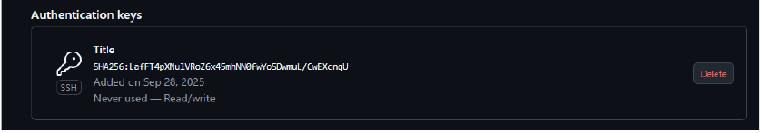
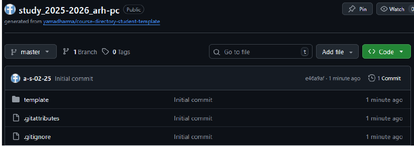
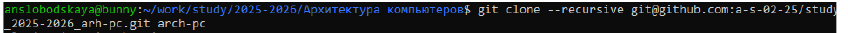
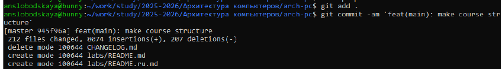
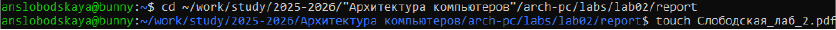
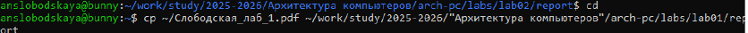

# **ОТЧЕТ ПО ЛАБОРАТОРНОЙ РАБОТЕ №2**
*Студент: Слободская Анна Николаевна*
*Группа: НПИбд-02-25*

## **Цель работы**
Целью работы является изучение идеологии и применения средств контроля версий, приобретение практических навыков по работе с системой контроля версий git.

## **2.4.1**
Создадим учётную запись на сайте https://github.com/ и заполним основные данные.

## **2.4.2.**
Сначала сделаем предварительную конфигурацию git. Откроем терминал и введём следующие команды:

Настроим utf-8 в выводе сообщений git:

Зададим имя начальной ветки (будем называть её master):

Параметр autocrlf:

Параметр safecrlf:

## **2.4.3.**
Генерируем ключ:

Копируем из локальной консоли ключ в буфер обмена:

Вставляем ключ в появившееся на сайте поле и указываем для ключа имя:

## **2.4.4.**
Откроем терминал и создадим каталог для предмета «Архитектура компьютера»:

## **2.4.5.**
Создадим репозиторий на основе шаблона курса https://github.com/yamadharma/course-directory-student-template. Назовём его study_2025–2026_arh-pc:

Откроем терминал и перейдём в каталог курса:

Клонируем созданный репозиторий:

## **2.4.6**
Перейдём в каталог курса:

Создадим необходимые каталоги:

Отправим файлы на сервер:

## **2.5.**
Создадим отчет по выполнению лабораторной работы в соответствующем каталоге рабочего пространства:

Скопируем отчеты по выполнению предыдущих лабораторных работ в соответствующие каталоги созданного рабочего пространства:

Загрузим файлы на github.

## **Вывод**
Изучили идеологию и применение средств контроля версий, приобрели практические навыки по работе с системой контроля версий git.
