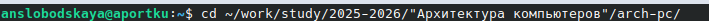
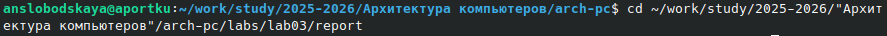
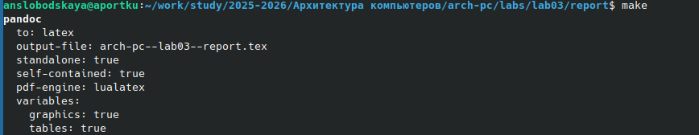
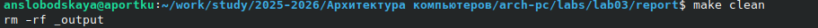
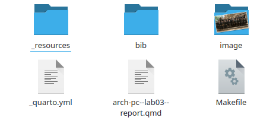
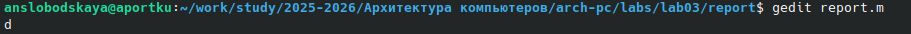
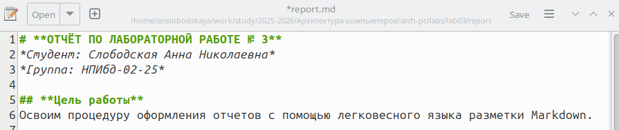
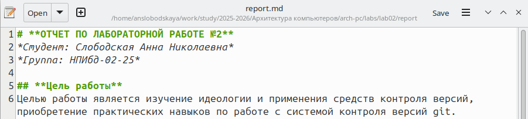

# **ОТЧЁТ ПО ЛАБОРАТОРНОЙ РАБОТЕ № 3**
*Студент: Слободская Анна Николаевна*
*Группа: НПИбд-02-25*

## **Цель работы**
Освоим процедуру оформления отчетов с помощью легковесного языка разметки Markdown.

## **3.4.**
Откроем терминал. Перейдём в каталог курса, сформированный при выполнении лабораторной работы № 2:

Обновим локальный репозиторий, скачав изменения из удаленного репозитория с помощью команды *git pull*:

Перейдём в каталог с шаблоном отчета по лабораторной работе № 3:

Проведём компиляцию шаблона с помощью Makefile. Для этого введём команду *make*:

При успешной компиляции должны сгенерироваться файлы report.pdf и report.docx.
Откроем и проверим корректность полученных файлов:
![*Файлы в подкаталоге output, созданном внутри каталога report, и их содержимое*]-(image/templates-present.png)

Удалим полученный файлы с использованием Makefile. Для этого введём команду *make clean*:

Проверим, что после этой команды файлы report.pdf и report.docx были удалены:

Откроем файл report.md c помощью gedit:

Внимательно изучим структуру этого файла.
Заполним и скомпилируем отчет с использованием Makefile. Проверим  корректность полученных файлов.

Загрузим файлы на Github.

## **3.5.**
В соответствующем каталоге сделаем отчёт по лабораторной работе № 2 в формате Markdown.

Загрузим файлы на github.

## **Вывод**
Освоили процедуру оформления отчетов с помощью легковесного языка разметки Markdown.
