**ОТЧЁТ ПО ЛАБОРАТОРНОЙ РАБОТЕ № 4**
*Студент: Слободская Анна Николаевна*
*Группа: НПИбд-02-25*

# **Цель работы**
Освоим процедуры компиляции и сборки программ, написанных на ассемблере NASM.

# **Порядок выполнения лабораторной работы**
## **Программа Hello world**
Создадим каталог для работы с программами на языке ассемблера NASM:

Перейдём в созданный каталог:
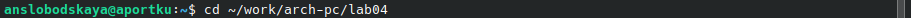

Создадим текстовый файл с именем hello.asm:
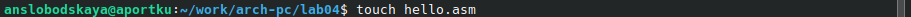

Откроем этот файл с помощью gedit:

Введём в него следующий текст:
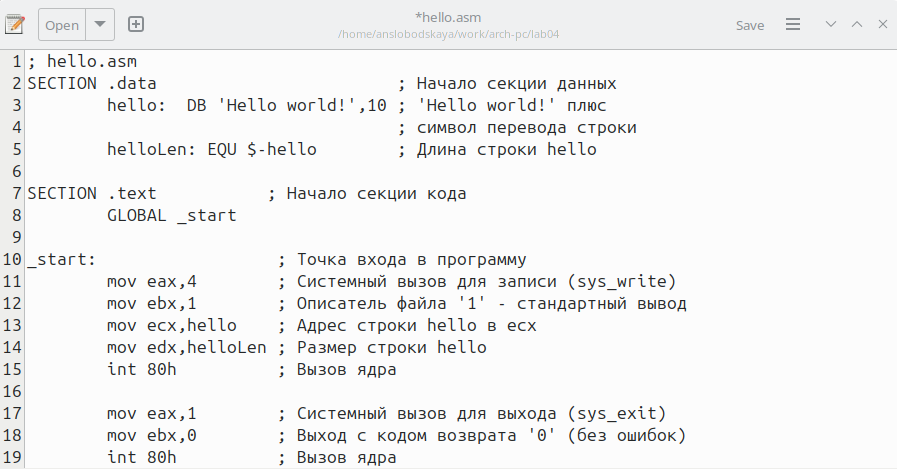

## **Транслятор NASM**
Для компиляции приведённого выше текста программы «Hello World» напишем команду:
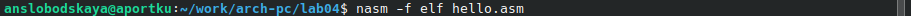

С помощью команды *ls* проверим, что объектный файл был создан:
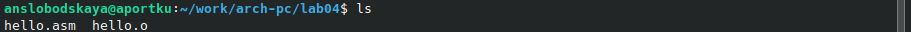

## ** Расширенный синтаксис командной строки NASM**
Для компиляции исходного файла hello.asm в obj.o выполним следующую команду:
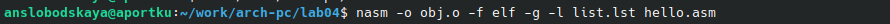

С помощью команды *ls* проверим, что файлы были созданы:
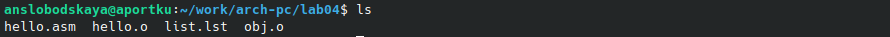

# **Компоновщик LD**
Передадим объектный файл на обработку компоновщику, чтобы получить исполняемую программу:
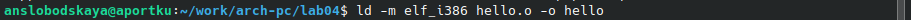

С помощью команды *ls* проверим, что исполняемый файл hello был создан:
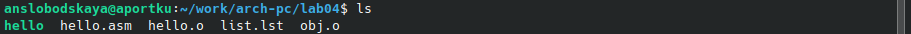

Выполним следующую команду:
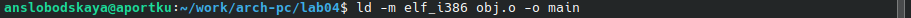
Исполняемый файл будет иметь имя *main*.
Объектный файл, из которого собран этот исполняемый файл, имеет имя *obj.o*.

## **Запуск исполняемого файла**
Запустим на выполнение созданный исполняемый файл, находящийся в текущем каталоге, набрав в командной строке следующую команду:
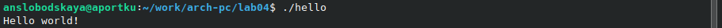

# **Задание для самостоятельной работы**
В каталоге ~/work/arch-pc/lab04 с помощью команды *cp* создадим копию файла hello.asm с именем lab4.asm:
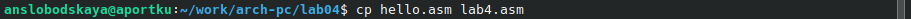

С помощью gedit внесём изменения в текст программы в файле lab4.asm так, чтобы вместо Hello world! на экран выводилось "Слободская Анна":
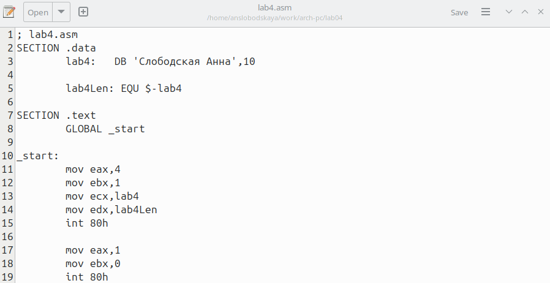

Оттранслируем полученный текст программы lab4.asm в объектный файл:

Выполним компоновку объектного файла и запустим получившийся исполняемый файл:
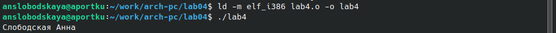

Скопируем файлы hello.asm и lab4.asm в локальный репозиторий в каталог ~/work/study/2023-2024/"Архитектура компьютеров"/arch-pc/labs/lab04/:
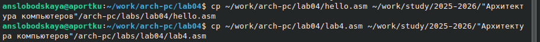

Загрузим файлы на Github.

# **Вывод**
Освоили процедуры компиляции и сборки программ, написанных на ассемблере NASM.
