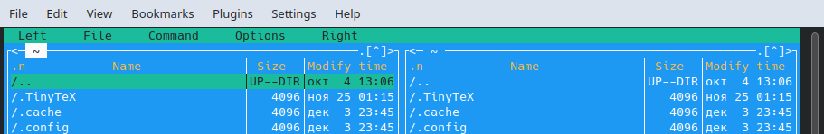
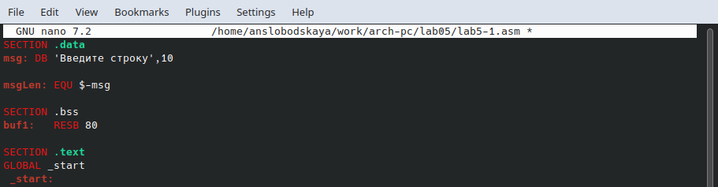
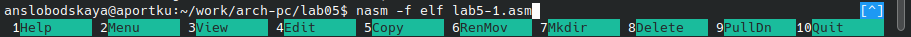
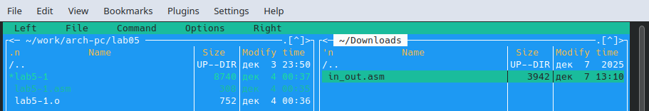
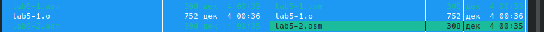
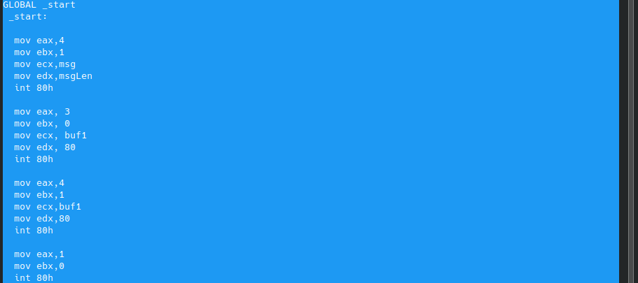

**ОТЧЁТ ПО ЛАБОРАТОРНОЙ РАБОТЕ № 5**
*Студент: Слободская Анна*
*Группа: НПИбд-02-25*

# **Цель работы**
Приобретение практических навыков работы в Midnight Commander. Освоение инструкций языка ассемблера mov и int.

# **Порядок выполнения лабораторной работы**
Откроем Midnight Commander:

Пользуясь клавишами ↑, ↓ и Enter перейдём в каталог ~/work/arch-pc созданный при выполнении лабораторной работы № 4:

С помощью функциональной клавиши F7 создадим папку lab05 и перейдём в созданный каталог:

Пользуясь строкой ввода и командой *touch* создадим файл lab5-1.asm:

С помощью функциональной клавиши F4 откроем файл lab5-1.asm для редактирования во встроенном редакторе *nano*:

Введём следующий текст:

Сохраним изменения и закроем файл.

С помощью функциональной клавиши F3 откроем файл lab5-1.asm для просмотра. Убедимся, что файл содержит текст программы:

Оттранслируем текст программы lab5-1.asm в объектный файл:

Выполним компоновку объектного файла и запустим получившийся исполняемый файл.
Программа выводит строку 'Введите строку:' и ожидает ввода с клавиатуры. На запрос введём ФИО:

## **Подключение внешнего файла in_out.asm**
Скачаем файл in_out.asm со страницы курса в ТУИС.

В одной из панелей mc откроем каталог с файлом lab5-1.asm. В другой панели каталог
со скаченным файлом in_out.asm:

Скопируем файл in_out.asm в каталог с файлом lab5-1.asm с помощью функциональной клавиши F5:

С помощью функциональной клавиши F6 создадим копию файла lab5-1.asm с именем lab5-2.asm:

Исправим текст программы в файле lab5-2.asm с использование подпрограмм из внешнего файла in_out.asm следующим образом: 

Создадим исполняемый файл и проверим его работу:

В файле lab5-2.asm заменим подпрограмму sprintLF на sprint:

Создадим исполняемый файл и проверим его работу:

При работе программы с использованием *sprintLF*, ввод производится на следующей строке после сообщения "Введите строку: ", а при работе программы с использованием *sprint* перехода на следующую строку не происходит.

# **Задание для самостоятельной работы**
Создадим копию файла lab5-1.asm:

Внесём изменения в программу (без использования внешнего файла in_out.asm), так чтобы она работала по следующему алгоритму:
	-вывести приглашение типа “Введите строку:”;
	-ввести строку с клавиатуры;
	-вывести введённую строку на экран.

Получим исполняемый файл и проверим его работу. На приглашение ввести строку введём фамилию:

Создадим копию файла lab5-2.asm:

Исправим текст программы с использование подпрограмм из внешнего файла in_out.asm, так чтобы она работала по следующему алгоритму:
	-вывести приглашение типа “Введите строку:”;
	-ввести строку с клавиатуры;
	-вывести введённую строку на экран.

Создадим исполняемый файл и проверим его работу:

Сохраним изменения и загрузим файлы на github.

# *Вывод*
Приобрели практические навыки работы в Midnight Commander. Освоили инструкции языка ассемблера mov и int.
