**ОТЧЁТ ПО ЛАБОРАТОРНОЙ РАБОТЕ № 6**
*Студент: Слободская Анна*
*Группа: НПИбд-02-25*

# **Цель работы**
Цель работы - освоение арифметических инструкций языка ассемблера NASM.

# **Порядок выполнения лабораторной работы**
## **Символьные и численные данные в NASM**
Создадим каталог для программ лабораторной работы № 6: 

Перейдём в него и создадим файл lab6-1.asm:

Введём в файл lab6-1.asm следующий текст:
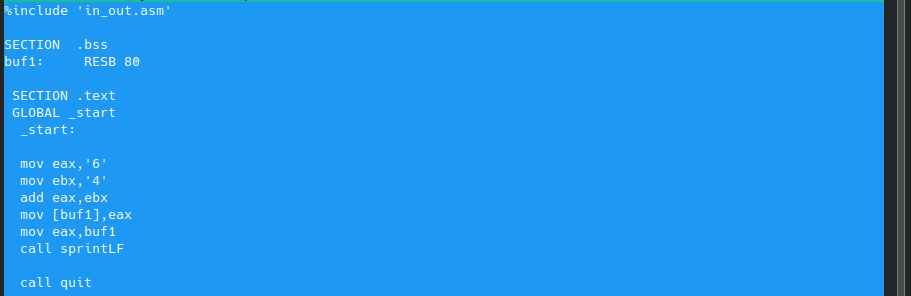

Создадим исполняемый файл и запустим его:
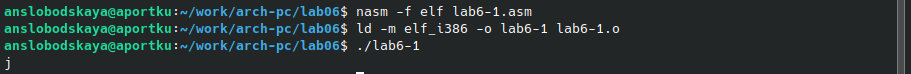
В данном случае при выводе результатом будет символ *j*. Это происходит потому, что код символа *6* равен *00110110* в двоичном представлении, а код символа *4* – *00110100*. Команда add eax,ebx запишет в регистр eax сумму кодов – *01101010*, что в свою очередь является кодом символа *j*.

Далее изменим текст программы и вместо символов, запишем в регистры числа:

Создадим исполняемый файл и запустим его:
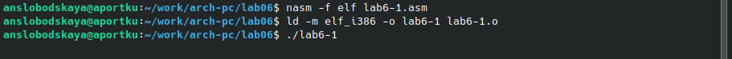

Преобразуем текст программы с использованием подпрограмм для преобразования ASCII символов в числа и обратно из in_out.asm. 
Создадим файл lab6-2.asm в каталоге ~/work/arch-pc/lab06:

Введём в него следующий текст:

Создадим исполняемый файл и запустим его:
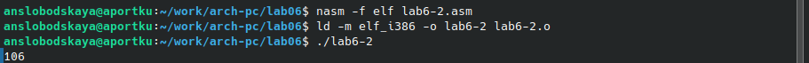
В результате работы программы мы получим число 106. В данном случае, как и в первом, команда add складывает коды символов ‘6’ и ‘4’. Однако, в отличии от первой программы, функция iprintLF позволяет вывести число, а не символ, кодом которого является это число.

Заменим символы на числа:

Создадим исполняемый файл и запустим его:
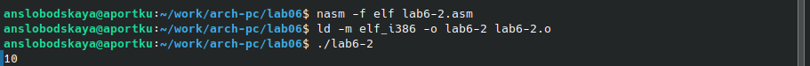

Заменим функцию iprintLF на iprint:

Создадим исполняемый файл и запустим его:
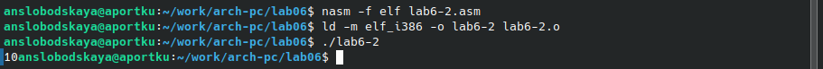
В отличие от программы с использованием подпрограммы *iprintLF*, при запуске программы с использованием *iprint* не происходит перехода на следующую строку после её выполнения.

## **Выполнение арифметических операций в NASM**
Создадим программу вычисления арифметического выражения 𝑓(𝑥) = (5 ∗ 2 + 3)/3.
Создадим файл lab6-3.asm в каталоге ~/work/arch-pc/lab06:

Введём следующий текст в lab6-3.asm:

Создадим исполняемый файл и запустим его:
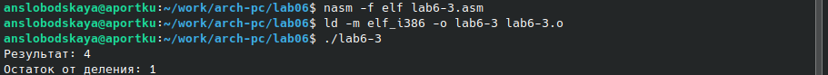

Изменим текст программы для вычисления выражения 𝑓(𝑥) = (4 ∗ 6 + 2)/5:
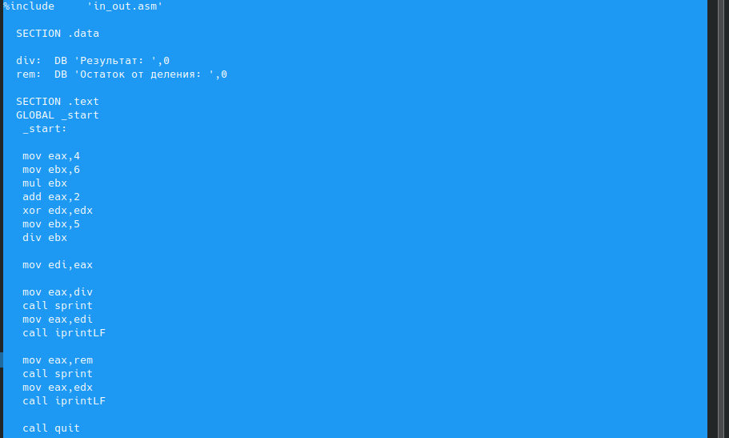

Создадим исполняемый файл и запустим его:
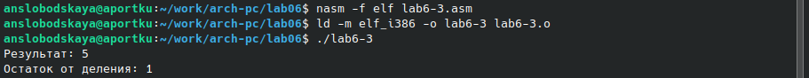

Рассмотрим программу вычисления варианта задания по номеру студенческого билета, работающую по следующему алгоритму:
 - вывести запрос на введение № студенческого билета;
 - вычислить номер варианта по формуле: (𝑆𝑛 mod 20) + 1, где 𝑆𝑛 – номер студенческого билета;
 - вывести на экран номер варианта.
Создадим файл variant.asm в каталоге ~/work/arch-pc/lab06:

Введём в файл variant.asm следующий текст:
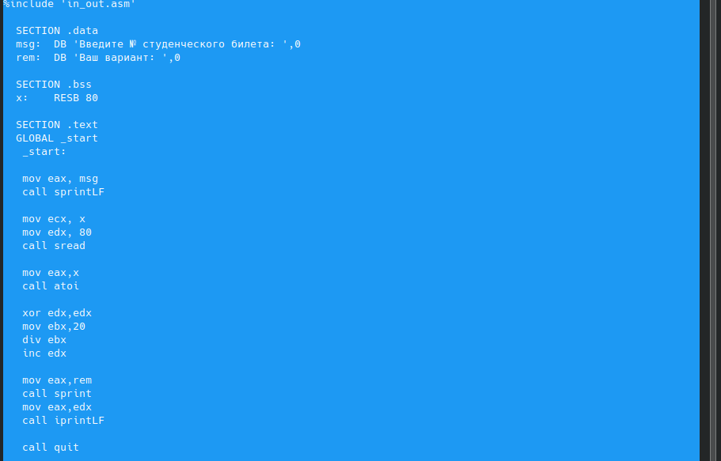

Создадим исполняемый файл и запустим его:
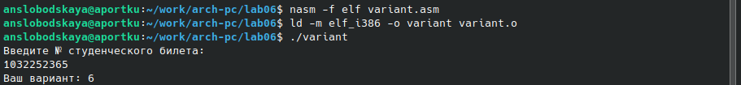

## **Ответы на вопросы**
 - *Какие строки программы variant отвечают за вывод на экран сообщения ‘Ваш вариант: ’?*
	mov eax,rem
	call sprint
 - *Для чего используется следующие инструкции?*
    - *mov ecx, x*
    - *mov edx, 80*
    - *call sread* 
	Для получения значения переменной *x* из ввода с клавиатуры.
 - *Для чего используется инструкция “call atoi”?*
	Для вызова подпрограммы, осуществляющей перевод ASCII кода в число.
 - *Какие строки программы variant отвечают за вычисления варианта?*
	xor edx,edx
	mov ebx,20
	div ebx
	inc edx
 - *В какой регистр записывается остаток от деления при выполнении инструкции “div ebx”?*
	В регистр *edx*.
 - *Для чего используется инструкция “inc edx”?*
	Для увеличения значения в регистре *edx* на 1.
 - *Какие строки программы variant отвечают за вывод на экран результата вычислений?*
	mov eax,edx
	call iprintLF

# **Задание для самостоятельной работы**
Напишем программу вычисления выражения 𝑥^3/2 + 1. 
Создадим файл answer.asm в каталоге ~/work/arch-pc/lab06:

Введём в него следующий текст:
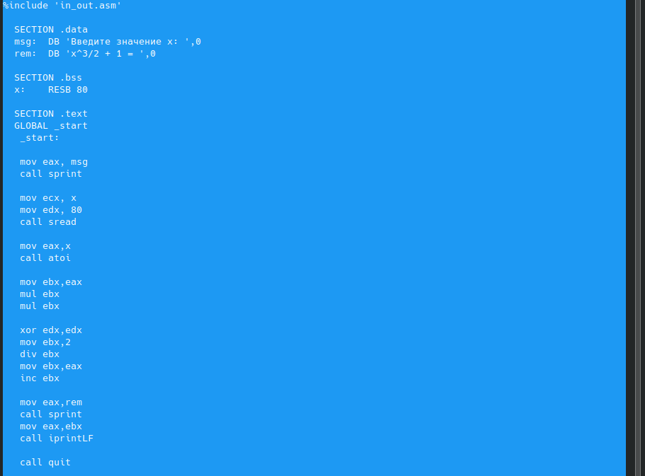

Создадим исполняемый файл:
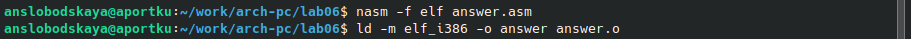

Проверим работу программы для x= 2:
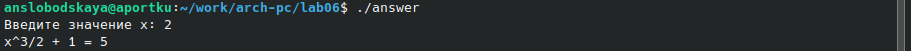

Проверим работу программы для x= 5:
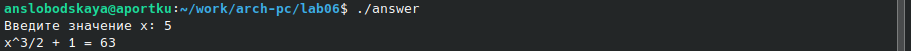

# **Вывод**
Освоили арифметические инструкции языка ассемблера NASM.
