**Отчёт по лабораторной работе №7**
*Студент: Слободская Анна Николаевна*
*Группа: НПИбд-02-25*

# **Цель работы**
Изучение команд условного и безусловного переходов. Приобретение навыков написания программ с использованием переходов. Знакомство с назначением и структурой файла листинга

# **Порядок выполнения лабораторной работы**
## **Реализация переходов в NASM**
Создадим каталог для программ лабораторной работы № 7:

Перейдём в него и создадим файл lab7-1.asm:
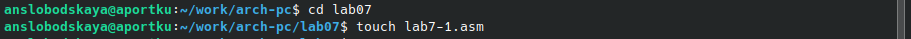

Введём в файл lab7-1.asm следующий текст:
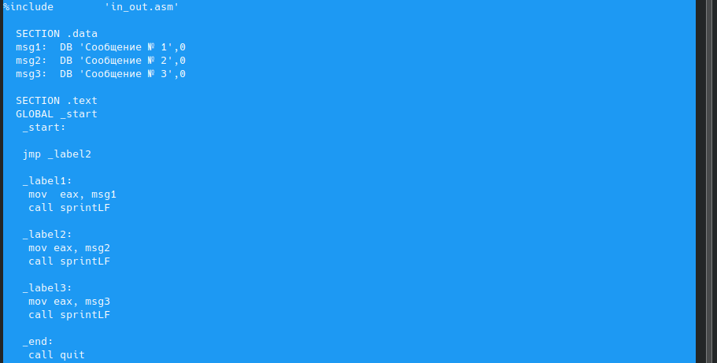

Создадим исполняемый файл и запустим его:
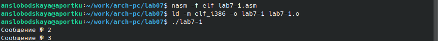

Изменим программу таким образом, чтобы она выводила сначала "Сообщение № 2", потом "Сообщение № 1" и завершала работу:
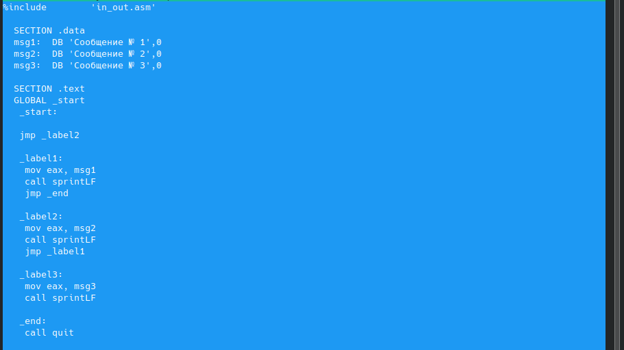

Создадим исполняемый файл и проверим его работу:
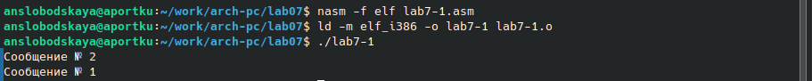

Изменим текст программы добавив или изменив инструкции *jmp*, чтобы вывод программы был следующим:
	Сообщение № 3
	Сообщение № 2
	Сообщение № 1
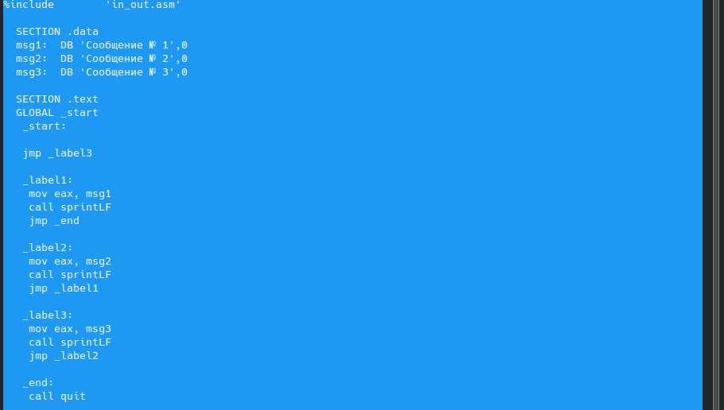

Создадим исполняемый файл и проверим его работу:
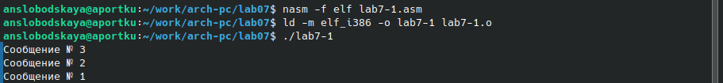

Создадим файл lab7-2.asm в каталоге ~/work/arch-pc/lab07:

Введём в lab7-2.asm следующий текст:
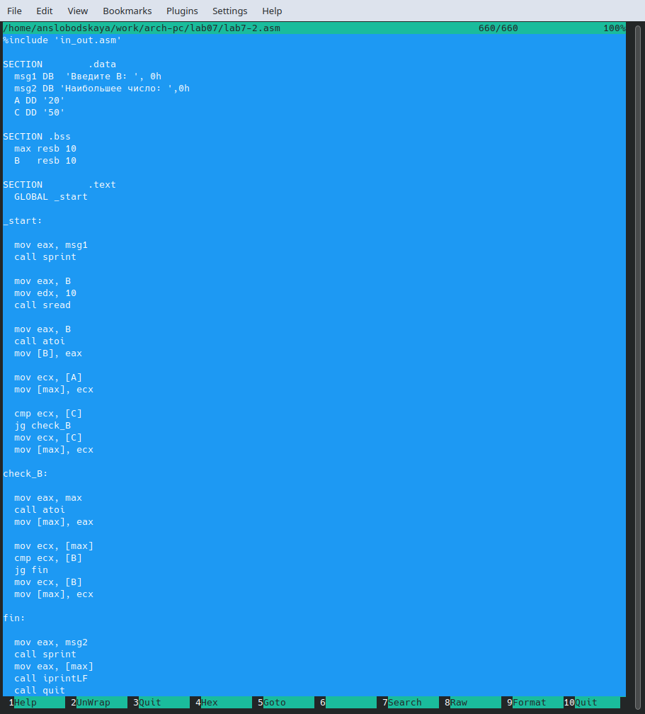

Создадим исполняемый файл:
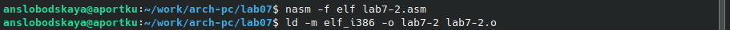
Проверим его работу для разных значений B:
	B = 10:
	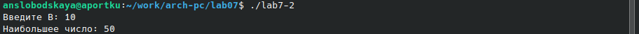
	B = 20:
	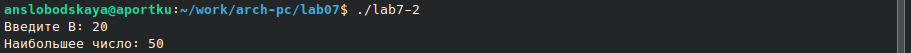
	B = 50:
	

## **Изучение структуры файлы листинга**
Создадим файл листинга для программы из файла lab7-2.asm, указав ключ *-l* и задав имя файла листинга в командной строке:

Откроем файл листинга lab7-2.lst с помощью mcedit:
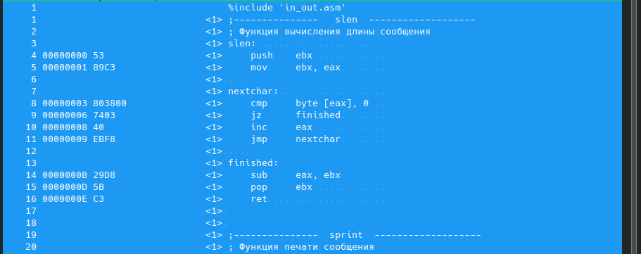

Откроем файл с программой lab7-2.asm и в любой инструкции с двумя операндами удалим один операнд:
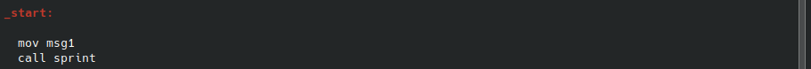

Выполним трансляцию с получением файла листинга:

В этом случае не создаётся файл lab7-2.o, а файл lab7-2.lst создаётся. 
В данном случае в листинге появляется сообщение об ошибке, так как инструкция *mov* не может работать с одним операндом:

# **Задание для самостоятельной работы**
Напишите программу нахождения наименьшей из 3 целочисленных переменных a, b и c.
Создадим файл lab7-3.asm в каталоге ~/work/arch-pc/lab07:

Введём в lab7-3.asm следующий текст:
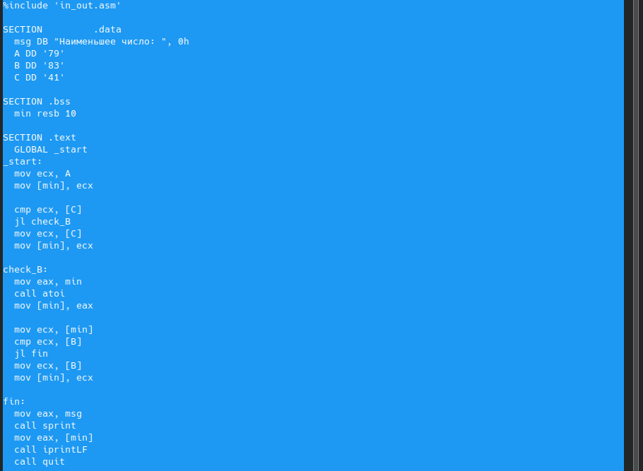

Создадим исполняемый файл и проверим его работу:

Напишим программу, которая для введенных с клавиатуры значений x и a вычисляет значение заданной функции *f(x)* и выводит результат вычислений.
Создадим файл lab7-4.asm в каталоге ~/work/arch-pc/lab07:

Введём в lab7-4.asm следующий текст:
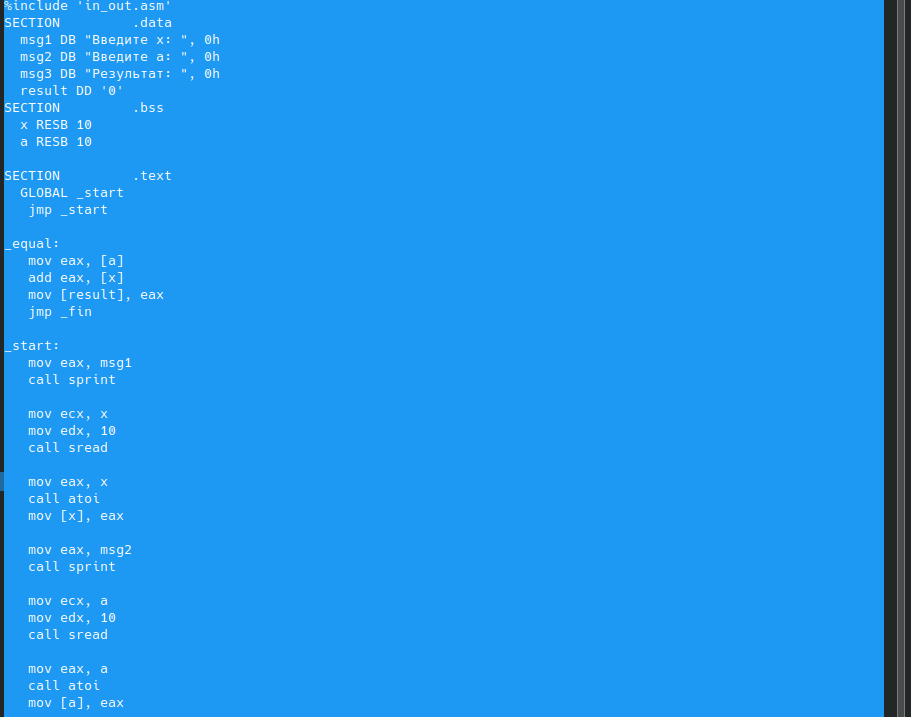
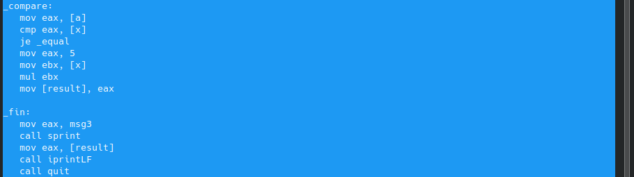

Создадим исполняемый файл:
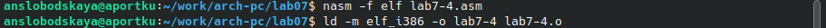
Проверим его работу для различных значений x и a.
	При x = a = 2:
	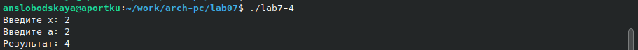
	При x = 2, a = 1:
	

# **Вывод**
Изучили команды условного и безусловного переходов. Приобрели навыки написания
программ с использованием переходов. Ознакомились с назначением и структурой файла
листинга.
