**ОТЧЁТ ПО ЛАБОРАТОРНОЙ РАБОТЕ № 8**
*Студент: Слободская Анна Николаевна*
*Группа: НПИбд-02-25*

# **Цель работы**
Приобретение навыков написания программ с использованием циклов и обработкой аргументов командной строки.

# **Порядок выполнения лабораторной работы**
## **Реализация циклов в NASM**
Создадим каталог для программ лабораторной работы № 8 и перейдём в него:
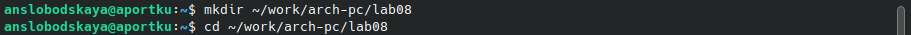

Cоздадим файл lab8-1.asm:

Введём в файл lab8-1.asm следующий текст:
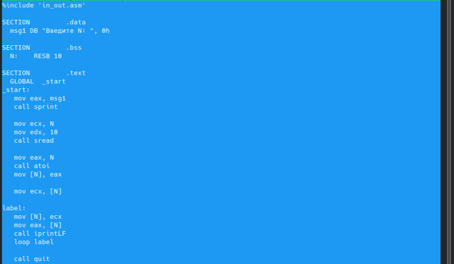

Создадим исполняемый файл и проверим его работу:
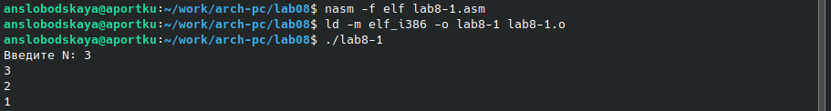

Изменим текст программы, добавив изменение значения регистра *ecx* в цикле:
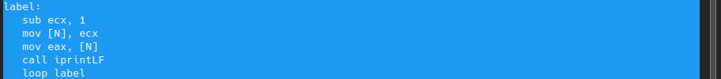

Создадим исполняемый файл и проверим его работу:
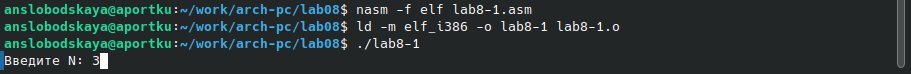
В данном случае регистр *ecx* принимает значение символа 3 в таблице ASCII, из-за чего число проходов цикла очень далеко от значения N, введённого с клавиатуры.

Для использования регистра *ecx* в цикле и сохранения корректности работы программы можно использовать стек. 
Внесём изменения в текст программы, добавив команды *push* и *pop* для сохранения значения счетчика цикла loop:
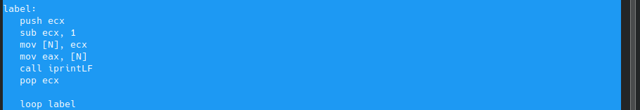

Создадим исполняемый файл и проверим его работу:
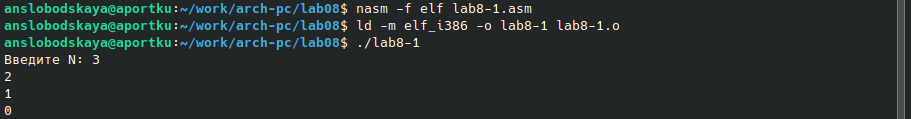
В этом случае число проходов цикла соответствует значению N, введенному с клавиатуры.

## **Обработка аргументов командной строки**
Создадим файл lab8-2.asm в каталоге ~/work/arch-pc/lab08:

Введём в него следующий текст:
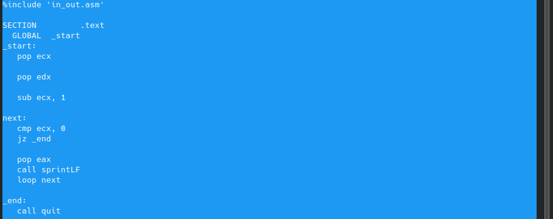

Создадим исполняемый файл и запустим его, указав аргументы:
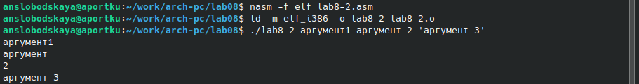
Программа обрабатывает 4 аргумента: *аргумент1*, *аргумент*, *2* и *аргумент 3*.

Создадим файл lab8-3.asm в каталоге ~/work/arch-pc/lab08:

Введём в него следующий текст:
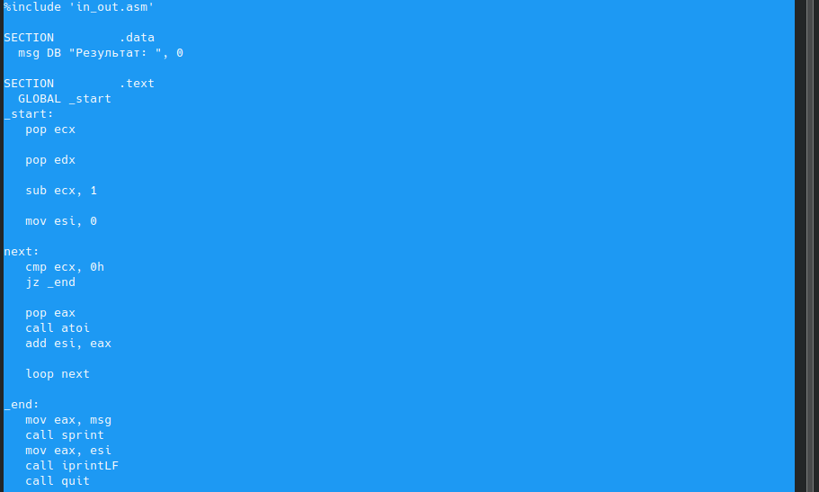

Создадим исполняемый файл и запустим его, указав аргументы:
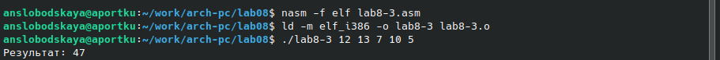

Изменим текст программы для вычисления произведения аргументов командной строки:
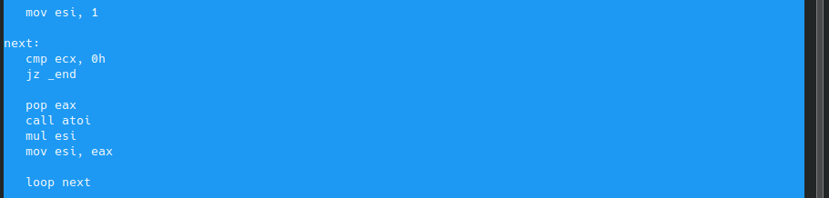

Создадим исполняемый файл и запустим его, указав аргументы:
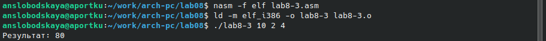

# **Задание для самостоятельной работы**
Напишем программу, которая находит сумму значений функции 4x + 3 для x= x(1), x(2), ..., x(n).
Создадим файл lab8-4.asm:

Введём в него следующий текст:

Создадим исполняемый файл:
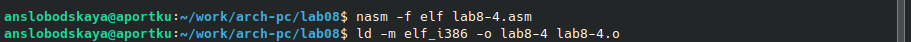

	Проверим его работу для x(1) = 1, x(2) = 2, x(3) = 3, x(4) = 4:
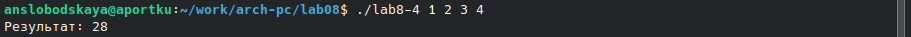

	Проверим его работу для x(1) = x(2) = 2, x(3) = x(4) = x(5) = 3, x(6) = 1:
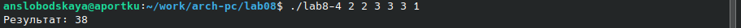

# **Вывод**
Приобрели навыки написания программ с использованием циклов и обработкой аргументов командной строки.
